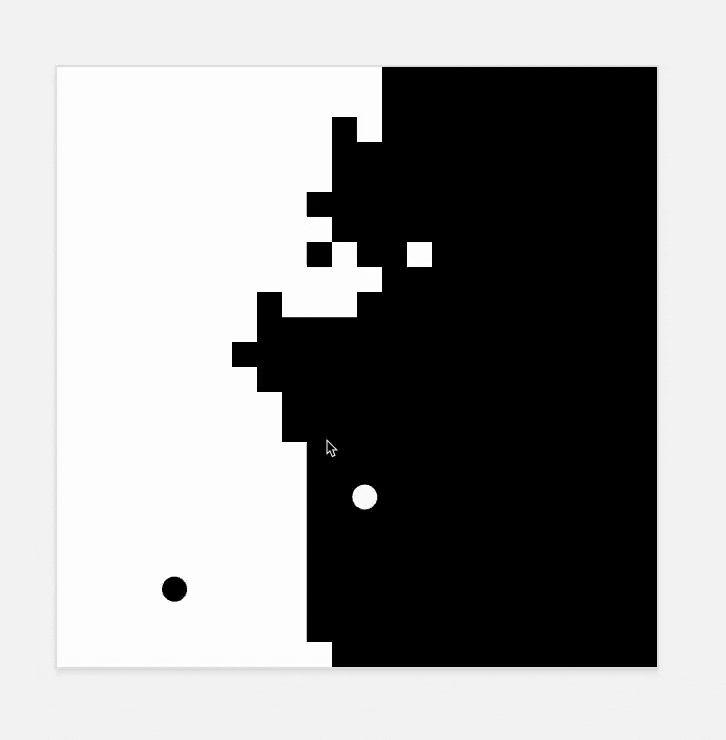

# Pong Wars

A visual battle simulation built with React, TypeScript, and p5.js where two balls compete for territory.

## Demo

## Features

- Automated battle between two colored balls
- Real-time territory tracking
- Dynamic collision physics
- Clean, minimalist interface

## Technologies Used

- React
- TypeScript
- p5.js for canvas rendering
- Vite for fast development

## How It Works

1. Two balls (black and white) automatically bounce around the screen
2. Each ball converts tiles to its color when it passes over them
3. Watch as the two balls battle for dominance
4. The simulation continues endlessly with constantly changing patterns

